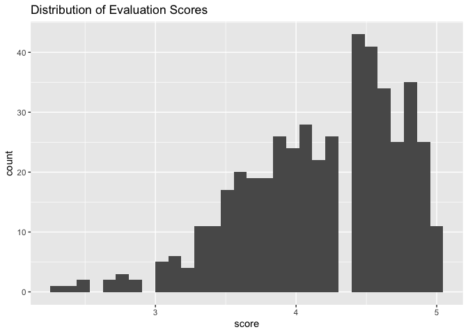
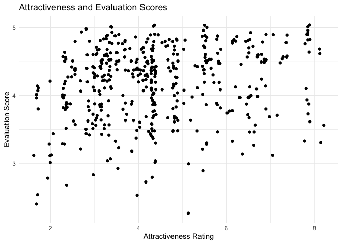
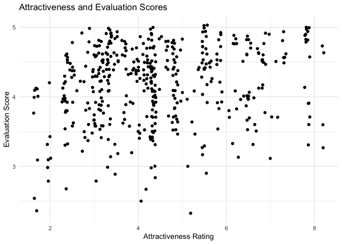
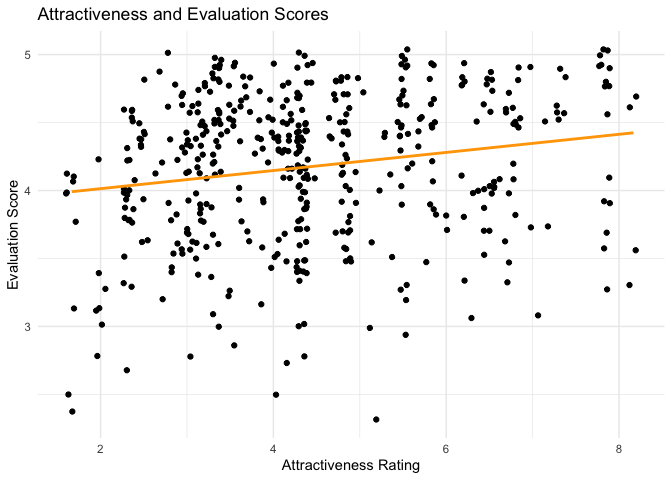

Lab 10 - Grading the professor
================
Cailey Fay
3.20.26

Here is a link to the [lab
instructions](https://datascience4psych.github.io/DataScience4Psych/lab10.html).

## Load Packages and Data

``` r
library(tidyverse) 
library(tidymodels)
library(openintro)
evals <- as.data.frame(evals)
```

### Part 1: Getting to know the outcome

Before we model anything, let’s look at what students actually do with
the evaluation scale.

1.  The distribution is left skewed. Students are pretty generous -
    there is clustering around the higher scores. The average score is a
    4.3 and the median is 4.3. The minimum score is 2.3.

``` r
ggplot(evals, aes(x=score)) +
  geom_histogram() +
  labs(title = "Distribution of Evaluation Scores")
```

    ## `stat_bin()` using `bins = 30`. Pick better value `binwidth`.

<!-- -->

``` r
summary(evals$score) %>% tidy()
```

    ## Warning in tidy.summaryDefault(.): `tidy.summaryDefault()` is deprecated.
    ## Please use `skimr::skim()` instead.

    ## # A tibble: 1 × 6
    ##   minimum    q1 median  mean    q3 maximum
    ##     <dbl> <dbl>  <dbl> <dbl> <dbl>   <dbl>
    ## 1     2.3   3.8    4.3  4.17   4.6       5

2.  It looks like there could be a ceiling effect. The scatterplot shows
    a very weak positive association, but the concentration of high
    evaluation scores makes interpretation challenging. Scores are all
    over the place.

``` r
ggplot(evals, aes(x=bty_avg, y=score)) +
  geom_jitter() +
  labs(title = "Attractiveness and Evaluation Scores",
       x = "Attractiveness Rating",
       y = "Evaluation Score") +
  theme_minimal()
```

<!-- -->

3.  Whoops I used jitter to begin with, because I looked at that regular
    scatterplot and said “no.” Heres the plot without jitter. You can
    also tell from this plot that there are a lot of high evaluation
    scores and maybe there is a positve trend, but jitter is better.
    Jitter shows more of the dots (if I’m not mistaken) which can help
    highlight concentrations of observations with similar scores on x
    and y.

``` r
ggplot(evals, aes(x=bty_avg, y=score)) +
  geom_point() +
  labs(title = "Attractiveness and Evaluation Scores",
       x = "Attractiveness Rating",
       y = "Evaluation Score") +
  theme_minimal()
```

<!-- -->

## Part 2: Beauty as a predictor

Let’s see if the apparent trend in the plot is something more than
natural variation.

## Exercise 1.

A one-point increase in beauty predicts a .066 point increase in
evaluation score. If someone had a beauty score of 0, their predicted
evaluation score is 3.88. Score = .066(beauty) + 3.88

``` r
m_bty <- linear_reg() %>%
  set_engine("lm") %>%
  fit(score ~ bty_avg, evals) 

glance(m_bty)
```

    ## # A tibble: 1 × 12
    ##   r.squared adj.r.squared sigma statistic   p.value    df logLik   AIC   BIC
    ##       <dbl>         <dbl> <dbl>     <dbl>     <dbl> <dbl>  <dbl> <dbl> <dbl>
    ## 1    0.0350        0.0329 0.535      16.7 0.0000508     1  -366.  738.  751.
    ## # ℹ 3 more variables: deviance <dbl>, df.residual <int>, nobs <int>

## Exercise 2.

Replot your existing visualization, this time add a regression line in
orange. Turn off the default shading around the line. (By default, the
plot includes shading around the line.)

``` r
ggplot(evals, aes(x=bty_avg, y=score)) +
  geom_jitter() +
  geom_smooth(method = "lm", se = FALSE, color = "orange") +
  labs(title = "Attractiveness and Evaluation Scores",
       x = "Attractiveness Rating",
       y = "Evaluation Score") +
  theme_minimal()
```

    ## `geom_smooth()` using formula = 'y ~ x'

<!-- -->

## Exercise 3.

How much do evaluation scores change with beauty ratings (slope)? The
slope is .066, meaning that evaluation scores increase by .066 for every
one-point increase in beauty. The intercept is 3.88, which means that if
someone had an attractiveness rating of 0, their predicted evaluation
score is 3.88. In this case, the intercept is meaningful, since it is
possible someone could get a 0 on attractiveness. The R-squared value is
.035, which means that 3.5% of the variance in evaluation scores is
explained by attractiveness. Therefore, attractiveness matters, but
96.5% of the variance in evaluation scores are left unexplained, so it
is a minor piece of the story.

The shading is turned off because right not we are just looking at how
the model fits the data in our sample. We are not trying to make any
inferences about the population just yet.

### Part 3

## Exercise 1

If I am correct in thinking female is coded as 1 and male as 2: the
coefficients suggest that the average male professor has an evaluation
score .14 points higher than the average female professor. Mean male =
4.37, mean female = 4.233.

``` r
m_gen <- lm(score ~ gender, data = evals)
tidy(m_gen)
```

    ## # A tibble: 2 × 5
    ##   term        estimate std.error statistic p.value
    ##   <chr>          <dbl>     <dbl>     <dbl>   <dbl>
    ## 1 (Intercept)    4.09     0.0387    106.   0      
    ## 2 gendermale     0.142    0.0508      2.78 0.00558

## Exercise 2

Mutating:

``` r
evals <- evals %>%
  mutate(rank_relevel = as.factor(case_when(
    rank == "teaching" ~ 2,
    rank == "tenure track" ~ 0,
    rank == "tenured" ~ 1)),
    tenure_eligible = case_when(
      rank == "teaching" ~ "no",
      rank == "tenure track" ~ "yes",
      rank == "tenured" ~ "yes"
    ))
```

Modeling:

``` r
#evaluations by rank regular 
m_rank <- linear_reg() %>%
  set_engine("lm") %>%
  fit(score ~ rank, evals) 
glance(m_rank)
```

    ## # A tibble: 1 × 12
    ##   r.squared adj.r.squared sigma statistic p.value    df logLik   AIC   BIC
    ##       <dbl>         <dbl> <dbl>     <dbl>   <dbl> <dbl>  <dbl> <dbl> <dbl>
    ## 1    0.0116       0.00733 0.542      2.71  0.0679     2  -372.  752.  768.
    ## # ℹ 3 more variables: deviance <dbl>, df.residual <int>, nobs <int>

``` r
#evaluations by rank_relevel
m_rel <- lm(score ~ rank_relevel, data = evals)
tidy(m_rel)
```

    ## # A tibble: 3 × 5
    ##   term          estimate std.error statistic   p.value
    ##   <chr>            <dbl>     <dbl>     <dbl>     <dbl>
    ## 1 (Intercept)     4.15      0.0521    79.7   2.58e-271
    ## 2 rank_relevel1  -0.0155    0.0623    -0.249 8.04e-  1
    ## 3 rank_relevel2   0.130     0.0748     1.73  8.37e-  2

``` r
#evaluations by tenure_eligible 
m_ten <- lm(score ~ tenure_eligible, data = evals)
tidy(m_ten)
```

    ## # A tibble: 2 × 5
    ##   term               estimate std.error statistic   p.value
    ##   <chr>                 <dbl>     <dbl>     <dbl>     <dbl>
    ## 1 (Intercept)           4.28     0.0536     79.9  2.72e-272
    ## 2 tenure_eligibleyes   -0.141    0.0607     -2.32 2.10e-  2

## Exercise 3

Based on the regression outputs, interpret how teaching faculty and
tenured faculty differ from that baseline. (Hint you should interpret
the slopes and intercepts for all three models in context of the data.)

In model 1, the baseline is teaching. The intercept is 4.28, which is
the average score for teaching track professors. Tenure track
professors, on average, score .13 below baseline, and tenured professors
are .14 points below baseline.

In model 2, the baseline is tenure. Now the intercept is 4.15
(representing the mean score for the tenured profs), and tenure track
professors score .02 below the tenured profs, and teaching professors
score .13 above tenured profs.

In model 3, it is broken down into tenure eligible vs not, and so tenure
track and tenure are collapsed into one group. The intercept is 4.28,
which (once again) representings the teaching profs score. on average,
the combined tenure eligible group is .14 points below the teaching
score.

## Exercise 4

These models are all communicating the same thing, but swapping around
whose mean is in the intercept slot. R2 is .01, meaning that it explains
only 1% of the variance in evaluation scores.

### Part 4

For Exercise 12, the `relevel()` function can be helpful!
